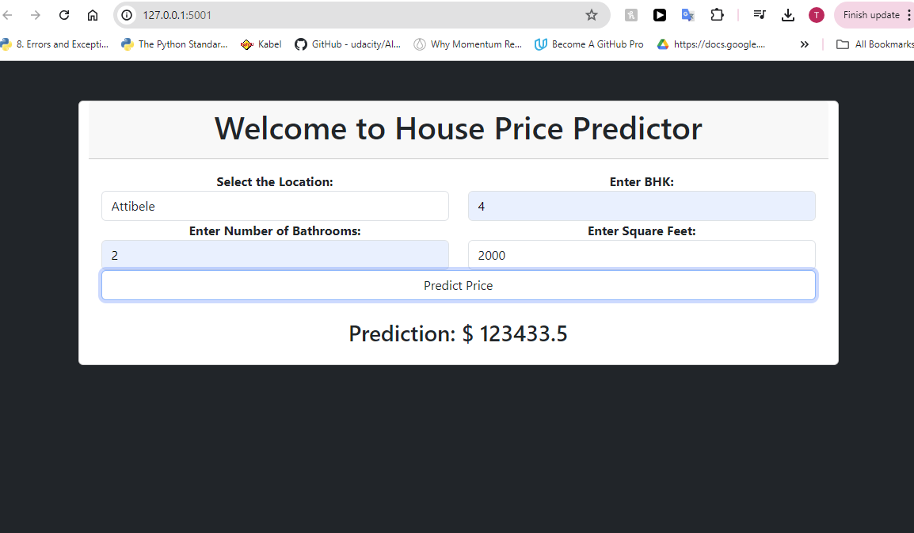

# House-Price-Predictor



This repository contains the code and resources for creating a Flask-based House price predictor that predict price of a house based on Location, Number of bathrooms, Number of BHks and Area(sqft)

## Table of Contents

- [Dataset](#Dataset)
- [Data Analysis](#Data_Analysis)
- [App Hosting](#App_Hosting)
- [Contributing](#contributing)
- [License](#license)

## Dataset

The dataset used for this project is the [Kaggle-Bangaluru House price data](https://www.kaggle.com/datasets/amitabhajoy/bengaluru-house-price-data?select=Bengaluru_House_Data.csv). It consists of a file 'Bengaluru_House_Data.csv'

## Requirements

To run this project, you will need the following dependencies:

- Python 3.7 or higher
- NumPy
- scikit-learn
- pickle
- pandas
- requests
- Flask
- Jupyter Notebook

## Installation

1. Clone this repository to your local machine:

   ```bash
   git clone https://github.com/Tanuj-joshi/House-Price-Predictor.git
   cd House-Price-Predictor
   ```

2. Download the dataset from Kaggle and place it in the Dataset/ directory.

## Usage

### Data_Analysis

Run all the code cells in 'predictor.ipynb file to generate a 'RidgeModel.pkl' binary file:

### App_Hosting

The above binary file is used in the script app.py to host the predictor system in a 
local ip (like an app) using Flask application.

Run the below command to host the predictor application in a local ip:

   ```bash
   python app.py
   ```

## Contributing

Contributions are welcome! If you have any ideas for improvements or new features, feel free to fork the repository and submit a pull request.

## License

This project is licensed under the MIT License. See the [LICENSE](LICENSE) file for more details.


