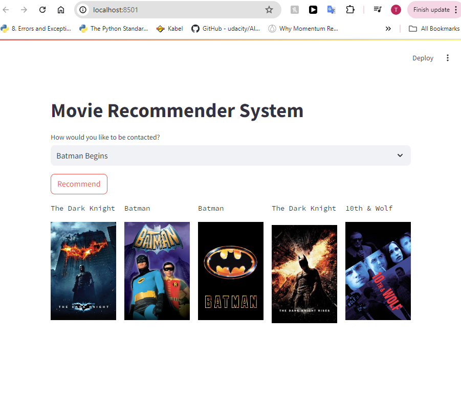

# Movie-Recommender-System



This repository contains the code and resources for creating a Streamlit-based movie recommender system that suggests movies and displays their posters using similarity scores and The Movie Database API.

## Table of Contents

- [Dataset](#Dataset)
- [Data Analysis](#Data_Analysis)
- [App Hosting](#App_Hosting)
- [Contributing](#contributing)
- [License](#license)

## Dataset

The dataset used for this project is the [Kaggle TMDB 5000 Movie Dataset](https://www.kaggle.com/datasets/tmdb/tmdb-movie-metadata). It consists of two files 'tmdb_5000_credits.csv' and 'tmdb_5000_movies.csv'

## Requirements

To run this project, you will need the following dependencies:

- Python 3.7 or higher
- NumPy
- nltk
- ast
- scikit-learn
- streamlit
- pickle
- pandas
- requests
- Jupyter Notebook (optional, for interactive experimentation)

## Installation

1. Clone this repository to your local machine:

   ```bash
   git clone https://github.com/Tanuj-joshi/Movie-Recommender-System.git
   cd Movie-Recommender-System
   ```

2. Download the dataset from Kaggle and place it in the Dataset/ directory.

## Usage

### Data_Analysis

Run all the code cells in 'recommender.ipynb file to generate two binary files:

    1) movie_dict.pkl
    2) similarity.pkl

### App_Hosting

The above two binary files are used in the script app.py to host the recommender system in a 
local ip (like an app) using Streamlit application.

Run the below command to stream the rcommender system:

   ```bash
   streamlit run app.py
   ```

## Contributing

Contributions are welcome! If you have any ideas for improvements or new features, feel free to fork the repository and submit a pull request.

## License

This project is licensed under the MIT License. See the [LICENSE](LICENSE) file for more details.


