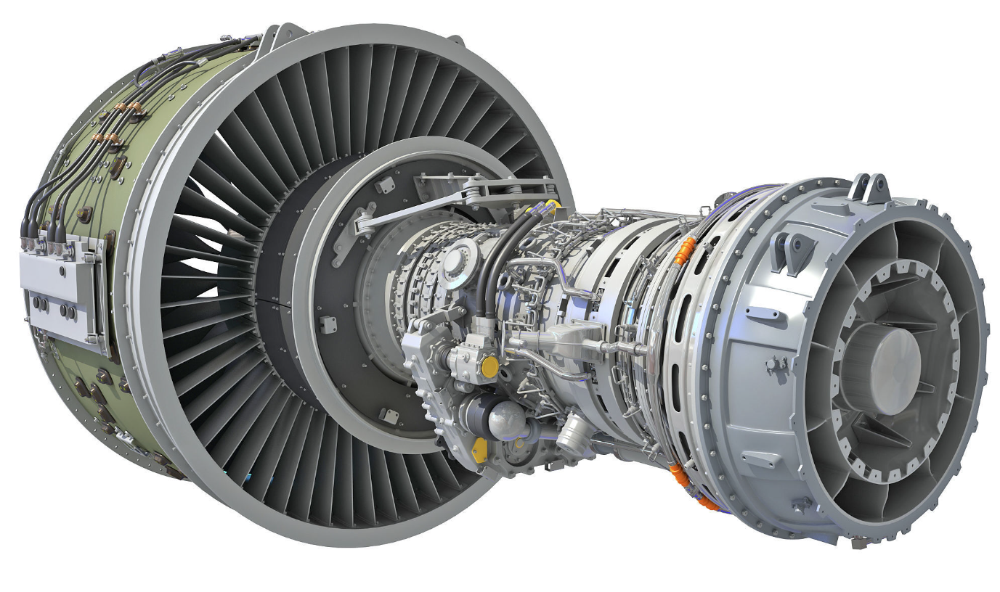

# Nasa Turbofan Engine Predictive Maintenance

Aim of this project is to predict whether or not some turbofan engines are going to break down within the next 100 cycles. The dataset consists of different multivariate time-series. These different time-series refer to different engines ( engine_id in the dataset). The sampling of the time series is 1 point per engine cycle ( timein_cycles in the dataset). The dataset is split into train data and test data to evaluate the model. In the train dataset: the engine runs until failure. It means that for each data point we can associate the RUL (Remaining Useful Life in cycles). In the test dataset: The engine runs until a certain point. What we need to predict is whether or not the engine is going to fail whithin the next 100 cycles.

## Dataset

The dataset used for this project is the [Kaggle-Nasa TurboFan Data](https://www.kaggle.com/code/darkside92/nasa-turbofan-engine-rul-predictive-maintenance/input). It consists of 3 text files. train data, test data and test results for model evaluation.

